# TrackMe Education
[](https://github.com/trackme-app/TrackMeEdu/actions/workflows/trigger-amplify-on-master-pr.yml)

TrackMe Education (TME) is an open-source, self-hostable Education & Learner Management System (ELMS).

## Goals
- AWS-native architecture
- Fully containerised for local development
- Microservice-based backend
- Multi-tenant, SaaS-ready design

## Repository Structure
- `apps/`       → User-facing applications (Frontend) and API entry points (Gateway).
- `services/`   → Backend microservices organized by educational domain.
- `packages/`   → Shared libraries, types, and utilities used across the monorepo.
- `infra/`      → Infrastructure as Code and local AWS parity tools (LocalStack).

## Local Development
This repository is designed to be run locally for development purposes. To do this, you will need to have openssl, Docker and Docker Compose installed on your system. Download and install them from the following links:
- [OpenSSL](https://www.openssl.org/)
- [Docker](https://www.docker.com/)
- [Docker Compose](https://docs.docker.com/compose/)

For additional development ease, it is recommended to also install:
- [NodeJS](https://nodejs.org/)

Once the pre-reqs are installed, download the repository and navigate to the root directory then run the command
```bash
sudo chmod +x run-dev.sh
```
### Starting a development environment
To start the local development environment, run the following commands (following any prompts):
```bash
./run-dev.sh -init
./run-dev.sh -start
```
**NOTE**: You will be prompted for a 'LOCAL_DOMAIN' value. This is used where VPNs are in use. If you are not using a VPN, please ensure set this value to 'tme.local'. If using a VPN, multi-tenancy is enabled using the highest-level portion of the domain as the tenant name. If no VPN is used, the tenant name 'test' will be assumed and multi-tenancy will not work.

The start process is complete once you see the line 'awscli-1 exited with code 0'. At this point, the application should be reachable on http://localhost:5173. 

**NOTE**: You can detach from the logs by pressing the `d` key on your keyboard if you wish to use the terminal for other things.

### Stopping a development environment
To stop the local development environment, run the following command:
```bash
./run-dev.sh -stop
```

### Cleaning up a development environment
To clean up any previous configuration and containers/images/volumes, run **one of** the following command:
```bash
sudo ./run-dev.sh -stop-clean
sudo ./run-dev.sh -clean
```
**NOTE**: You may be prompted to input your sudo password while running these commands.

## Documentation Index

### Applications
- [**Frontend**](./apps/frontend/README.md) - The main React user interface.
- [**API Gateway**](./apps/api-gateway/README.md) - Routing and security layer for all service requests.

### Service Domains

#### [Academic & Learning](./services/Academic%20&%20Learning/README.md)
- [Assessment & Grading](./services/Academic%20&%20Learning/Assessment%20&%20Grading/README.md)
- [Course & Curriculum](./services/Academic%20&%20Learning/Course%20&%20Curriculum/README.md)
- [Learning Management System (LMS)](./services/Academic%20&%20Learning/Learning%20Management%20System/README.md)
- [Scheduling & Timetable](./services/Academic%20&%20Learning/Scheduling%20&%20Timetable/README.md)

#### [Administrative](./services/Administrative/README.md)
- [Admissions](./services/Administrative/Admissions/README.md)
- [Identity & Access Management (IAM)](./services/Administrative/Identity%20&%20Access%20Management/README.md)
- [Staff Information](./services/Administrative/Staff%20Information/README.md)
- [Student Information](./services/Administrative/Student%20Information/README.md)
- [Tenancy Service](./services/Administrative/Tenancy/README.md)

#### [Operations & Communication](./services/Operations%20&%20Communication/README.md)
- [Attendance](./services/Operations%20&%20Communication/Attendance/README.md)
- [Finance & Fees](./services/Operations%20&%20Communication/Finance%20&%20Fees/README.md)
- [Library](./services/Operations%20&%20Communication/Library/README.md)
- [Notifications](./services/Operations%20&%20Communication/Notifications/README.md)

## Architecture
The system is designed to be modular and scalable, with each service responsible for a specific domain of functionality. The API Gateway serves as the single entry point for all client requests, routing them to the appropriate microservice based on the request path.

```mermaid
architecture-beta
    group public_api(logos:aws-vpc)[Public Subnet]
    group private_api(logos:aws-vpc)[Private Subnet] in public_api

    service gateway(logos:aws-api-gateway)[API Gateway] in public_api
    service ui(logos:aws-amplify)[Frontend]

    service auth(logos:aws-fargate)[Auth Service] in private_api
    service user(logos:aws-fargate)[User Service] in private_api
    service course(logos:aws-fargate)[Course Service] in private_api
    service assessment(logos:aws-fargate)[Assessment Service] in private_api
    service schedule(logos:aws-fargate)[Schedule Service] in private_api
    service notification(logos:aws-fargate)[Notification Service] in private_api
    service attendance(logos:aws-fargate)[Attendance Service] in private_api
    service finance(logos:aws-fargate)[Finance Service] in private_api
    service library(logos:aws-fargate)[Library Service] in private_api

    service endUser(mdi:computer)[End User]

    
    endUser:L --> R:ui
    ui:L --> R:gateway

    gateway:L --> R:auth
    gateway:L --> R:user
    gateway:L --> R:course
    gateway:L --> R:assessment
    gateway:L --> R:schedule
    gateway:L --> R:notification
    gateway:L --> R:attendance
    gateway:L --> R:finance
    gateway:L --> R:library
```


