# TrackMe Education

TrackMe Education (TME) is an open-source, self-hostable Education & Learner Management System (ELMS).

## Goals
- AWS-native architecture
- Fully containerised local development
- Microservice-based backend
- Multi-tenant SaaS-ready design

## Repository Structure
- `apps/`       → User-facing applications (Frontend) and API entry points (Gateway).
- `services/`   → Backend microservices organized by educational domain.
- `packages/`   → Shared libraries, types, and utilities used across the monorepo.
- `infra/`      → Infrastructure as Code and local AWS parity tools (LocalStack).

## Documentation Index

### Applications
- [**Frontend**](./apps/frontend/README.md) - The main React user interface.
- [**API Gateway**](./apps/api-gateway/README.md) - Routing and security layer for all service requests.

### Service Domains

#### [Academic & Learning](./services/Academic%20&%20Learning/README.md)
- [Assessment & Grading](./services/Academic%20&%20Learning/Assessment%20&%20Grading/README.md)
- [Course & Curriculum](./services/Academic%20&%20Learning/Course%20&%20Curriculum/README.md)
- [Learning Management System (LMS)](./services/Academic%20&%20Learning/Learning%20Management%20System/README.md)
- [Scheduling & Timetable](./services/Academic%20&%20Learning/Scheduling%20&%20Timetable/README.md)

#### [Administrative](./services/Administrative/README.md)
- [Admissions](./services/Administrative/Admissions/README.md)
- [Identity & Access Management (IAM)](./services/Administrative/Identity%20&%20Access%20Management/README.md)
- [Staff Information](./services/Administrative/Staff%20Information/README.md)
- [Student Information (SIS)](./services/Administrative/Student%20Information/README.md)

#### [Operations & Communication](./services/Operations%20&%20Communication/README.md)
- [Attendance](./services/Operations%20&%20Communication/Attendance/README.md)
- [Finance & Fees](./services/Operations%20&%20Communication/Finance%20&%20Fees/README.md)
- [Library](./services/Operations%20&%20Communication/Library/README.md)
- [Notifications](./services/Operations%20&%20Communication/Notifications/README.md)

## Local Development
Docker and Docker Compose are used to simulate AWS services locally.

## Architecture
The system is designed to be modular and scalable, with each service responsible for a specific domain of functionality. The API Gateway serves as the single entry point for all client requests, routing them to the appropriate microservice based on the request path.

```mermaid
architecture-beta
    group public_api(logos:aws-vpc)[Public Subnet]
    group private_api(logos:aws-vpc)[Private Subnet] in public_api

    service gateway(logos:aws-api-gateway)[API Gateway] in public_api
    service ui(logos:aws-amplify)[Frontend]

    service auth(logos:aws-fargate)[Auth Service] in private_api
    service user(logos:aws-fargate)[User Service] in private_api
    service course(logos:aws-fargate)[Course Service] in private_api
    service assessment(logos:aws-fargate)[Assessment Service] in private_api
    service schedule(logos:aws-fargate)[Schedule Service] in private_api
    service notification(logos:aws-fargate)[Notification Service] in private_api
    service attendance(logos:aws-fargate)[Attendance Service] in private_api
    service finance(logos:aws-fargate)[Finance Service] in private_api
    service library(logos:aws-fargate)[Library Service] in private_api

    service endUser(mdi:computer)[End User]

    
    endUser:L --> R:ui
    ui:L --> R:gateway

    gateway:L --> R:auth
    gateway:L --> R:user
    gateway:L --> R:course
    gateway:L --> R:assessment
    gateway:L --> R:schedule
    gateway:L --> R:notification
    gateway:L --> R:attendance
    gateway:L --> R:finance
    gateway:L --> R:library
```

